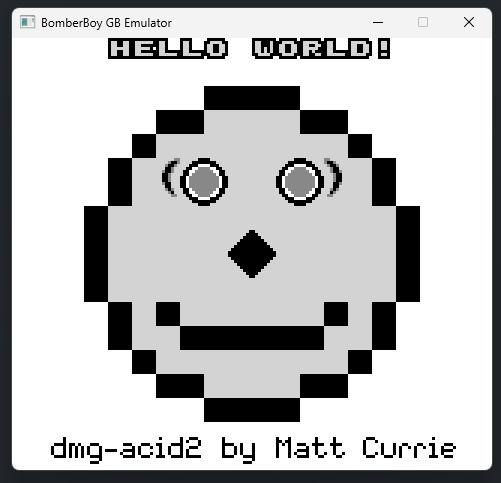
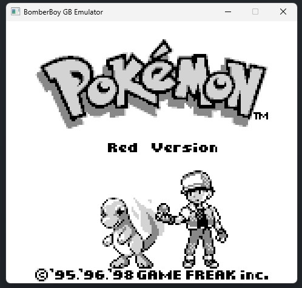

# BomberBoy

Written in C#, this emulator passes dmg-acid2 and most Blargg tests.




## Building and Running

This project is built using the .NET 9 SDK.

### 1. Clone the repository

```sh
git clone https://github.com/qalibr/BomberBoy.git
cd BomberBoy
```

### 2. Build the project

```sh
dotnet build
```

### 3. Run the emulator

Pass the path to a Game Boy ROM as a command-line argument.

```sh
dotnet run --project BomberBoy/BomberBoy.csproj -- path/to/your/rom.gb
```

## Keymap

| Action        | Key           |
| ------------- | ------------- |
| D-Pad Up      | `W`           |
| D-Pad Down    | `S`           |
| D-Pad Left    | `A`           |
| D-Pad Right   | `D`           |
| A Button      | `E`           |
| B Button      | `R`           |
| Start         | `F`           |
| Select        | `Z`           |
| Save State    | `CTRL` + `T`  |
| Restore State | `CTRL` + `L`  |

## Test ROMs Status

| Test ROM                  | Status |
| ------------------------  | :----: |
| `cpu_instrs.gb`           |   ✅   |
| `instr_timing.gb`         |   ✅   |
| `mem_timing.gb`           |   ✅   |
| `dmg-acid2.gb`            |   ✅   |
| `oam_bug.gb`              |   ❌   |
| `interrupt_time.gb`       |  N/A   |
| `halt_bug.gb`             |  N/A   |

## Features

| Feature              | Status         | Notes                                                     |
| -------------------- | :------------: | --------------------------------------------------------- |
| **Core**             |                |                                                           |
| CPU                  |       ✅       | Passes Blargg's `cpu_instrs` and `instr_timing` tests.    |
| Timer                |       ✅       | Implemented with correct `DIV` and `TIMA` logic.          |
| **Hardware**         |                |                                                           |
| PPU (Video)          |       🟡       | Passes `dmg-acid2`, but fails `oam_bug`.                  |
| APU (Sound)          |       ❌       | No sound hardware emulation yet.                          |
| Joypad Input         |       ✅       | Handles user input.                                       |
| **Cartridge**        |                |                                                           |
| MBC Support          |       🟡       | MBC1 & MBC3 (with RTC) supported. Others not yet.         |
| Save States          |       ✅       | Ability to save/load game progress.                       |
| **Emulator**         |                |                                                           |
| Drag & Drop          |       ✅       | (Can still run directly with CLI args.)                   |
| GUI / Frontend       |       🟡       | Basic window via Raylib-cs. No menus or options.          |

## Resoures

<https://gbdev.io/pandocs/>

<https://gbdev.io/gb-opcodes/optables/>

<https://github.com/gbdev/awesome-gbdev>

### Testing

<https://github.com/robert/gameboy-doctor>

<https://github.com/retrio/gb-test-roms>

<https://github.com/mattcurrie/dmg-acid2>

## Emulators

These emulator's have been crucial for my success thus far.

<https://github.com/rockytriton/LLD_gbemu>

<https://github.com/BluestormDNA/ProjectDMG>

<http://www.codeslinger.co.uk/pages/projects/gameboy/beginning.html>

## Libraries

<https://github.com/raylib-cs/raylib-cs>
